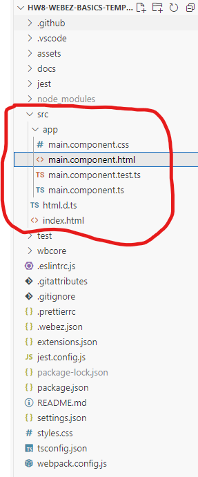
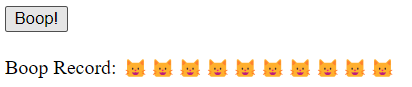

# WebEZ Basics Walkthrough

This walkthrough will help you build and deploy your first WebEZ application. You will learn how to create components, bind values, and handle basic events.

## 0) Setup

1. Click the Github classroom link to create your own copy of the starter repo: <https://classroom.github.com/a/xps8JAYp>
2. Clone the repo to your local machine in an appropriate directory.
3. Open the directory in VS Code, as you normally do.
4. Run `npm install` to install the dependencies.

```bash
npm install
```

5. Normally, you would then run `npm run start` to start the development server. However, we will be using the integrated debugger in VS Code. Activate this by pressing `F5` on your keyboard (or selecting the "Run" tab from the top menu and then clicking `Start Debugging`). This will open a new browser window with your application running. The debugger has a bunch of useful features, like setting breakpoints and inspecting variables - we'll talk more about them later on.

6. You should now be able to see your website. It won't be very exciting at first, but you can now start editing the code and see the changes in real-time!

## 1) Basic HTML

Let's start by adding some dynamic text to the page. We'll need to edit the `MainComponent`, which came with the starter repo. This is the main component that is displayed on the page, and there's always exactly one of them in every WebEZ application. Although we created the component for you, we haven't done anything else. Let's add some text to the page.

1. Expand the `src/app` folder in the sidebar. You will see four files there: `main.component.ts`, `main.component.html`, `main.component.css`, and `main.component.test.ts`. 



  * `main.component.html` is the HTML file that defines the structure of the component. This is where we put the visual content of your application.
  * `main.component.css` is the CSS file that defines the styles for the component. This is how we make things look pretty.
  * `main.component.ts` is the TypeScript file that defines the `MainComponent` class. This is where the application logic will go.
  * `main.component.test.ts` is a (mostly empty) test file for the component. We'll talk more about testing your own components later on.

2. Open `main.component.html`. You will see that it contains the following code:

```html
<div>
    <div class="header">
        <div class="title">hw8-webez-basics Example</div>
    </div>
</div>
```

This is the default content that comes with the starter repo. The `div` tag is a generic container that can hold other elements (a "division" of content). In this case, we have a `div` with the class `header`, which contains a `div` with the class `title`. The `class` attribute is used to apply CSS styles to the element. We'll talk more about CSS later on. For now, focus on the text inside of the `div` tags.

3. Change the text inside the `div` with the class `title` to something else. For example, you could change it to:

```html
<div class="title">My First WebEZ Application</div>
```

4. Save the file. You should see the changes reflected in the browser window automatically. If you don't see the changes, make sure that the debug mode is still running. 

5. Now, let's add a new element to the page with some more text. Add the following code after the `div` with the class `header`, but inside the outer `div`. The `p` tag is used to create a paragraph of text.

```html
<p>Welcome from the HTML side!</p>
```

If you did this correctly, the HTML should look something like the HTML below. Pay close attention to the structure of your HTML, and make sure you are closing all of your tags properly. The location of tags is important, as it determines how the elements are displayed on the page.

```html
<div>
    <div class="header">
        <div class="title">My First WebEZ Application</div>
    </div>
    <p>Welcome from the HTML side!</p>
</div>
```

6. Save the file, and confirm that the new text is displayed in the browser window.
7. We're going to modify the `p` tag to include an `id` attribute. This will make it easier to test our application later on. Add the `id` attribute to the `p` tag, like so:

```html
<p id="example-text">Welcome from the HTML side!</p>
```

Make sure you use the exact `id` value (`example-text`) as shown above. When you save the file, the page will not look any differently. The `id` attribute is used to uniquely identify an element in the HTML document, but does not affect the appearance of the element.

8. Now, let's add some dynamic text to the page. We're going to use TypeScript to change the text of a new `p` tag. Make a second, empty `p` tag with an `id` after the existing one, like so:

```html
<p id="example-target"></p>
```

<details markdown="block">
<summary>Click here to see the full HTML so far</summary>

```html
<div>
    <div class="header">
        <div class="title">My First WebEZ Application</div>
    </div>
    <p id="example-text">Welcome from the HTML side!</p>
    <p id="example-target"></p>
</div>
```

</details>

{: .important-title }

> IDs Matter!
> 
> Make sure you are matching the `id` values exactly as shown above. This will become important when we run the tests later!

9. Open `main.component.ts`. This is the TypeScript file that defines the `MainComponent` class. This is where the application logic will go. You will see that it contains the following code:

```typescript
import html from "./main.component.html";
import css from "./main.component.css";
import { EzComponent } from '@gsilber/webez';

/**
 * @description MainComponent is the main component of the app
 * @extends EzComponent
 * 
 */
export class MainComponent extends EzComponent {

    constructor() {
        super(html, css);
    }
}
```

In WebEZ, components are defined as classes that extend the `EzComponent` class. The `MainComponent` class is the main component of the application, and it is the component that is displayed on the page. The `constructor` method is called when an instance of the class is created. In this case, we are calling the `super` method with the `html` and `css` variables. This is how we tell WebEZ to use the HTML and CSS files that we created. The `html` and `css` variables are just strings that contain the contents of the HTML and CSS files, imported from the files themselves.

10. Add a new private `string` field to the `MainComponent` class called `myText`, with the initial value `"Hello from the TypeScript side!"`. This field will hold the text that we want to display on the page.

```typescript
private myText: string = "Hello from the TypeScript side!";
```

11. On its own, just creating a field doesn't do anything interesting. We need to *bind* the field to the HTML so that the text is displayed on the page. We can do this by using the `BindValue` decorator. Add the following code directly above the `myText` field:

```typescript
@BindValue("example-target")
```

The `@BindValue` decorator is used to bind a field to an element in the HTML; in general, a decorator can enhance the functionality of a field or a method of a class. This decorator takes a single argument, which is the `id` of the element that we want to bind to. In this case, we are binding the `myText` field to the element with the `id` `example-target`.

12.  In order to use the decorator, we must also import the `BindValue` decorator from the `@gsilber/webez` package. Modify the existing import statement at the top of the file to include the `BindValue` decorator:

```typescript
import { EzComponent, BindValue } from '@gsilber/webez';
```

13. If you save the file now, you should be able to see the changes in the live webpage. The text `"Hello from the TypeScript side!"` should be displayed on the page. This is because the `myText` field is bound to the `example-target` element in the HTML. When the field changes, the text on the page will automatically update.

<details markdown="block">
<summary>Click here to see the full TypeScript file so far</summary>

```typescript
import html from "./main.component.html";
import css from "./main.component.css";
import { EzComponent, BindValue } from '@gsilber/webez';

export class MainComponent extends EzComponent {

    @BindValue("example-target")
    private myText: string = "Hello from the TypeScript side!";

    constructor() {
        super(html, css);
    }
}
```

</details>

14. To test if your website is working correctly, you can run the tests that are included with the starter repo. To do this, open a terminal in VS Code and run the following command:

```bash
npm run test main
```

This will run the `main.test.ts` file that is included with the starter repo. If everything is working correctly, you should see a message that says `All tests passed!`. If you see any errors, double-check your code to make sure everything is correct.

## 2) Boop Button Component

Now we'll create a second component that lives in the `MainComponent`. This component will have a button that, when clicked, will add a bit of text to the screen. We'll use this to demonstrate how to handle events in WebEZ. We will call this component the "Boop Button", since our example will be about booping cat's noses. In the image below, every time the button is clicked, another cat head ("🐱") will be added to the record.



1. Begin by creating the new Boop Button component. This requires running a terminal command from within the `src/app` directory. Navigate to the terminal in VS Code and run the following commands:

```bash
cd src/app/
webez c boop-button
```

<details markdown="block">
<summary>Click here to see the expected output for this command</summary>

```
webez v.0.4.11 is starting...
Creating a new component: boop-button
Copying scaffold files
Component scaffold created
Finished
```

</details>

The `c` in the command is short for `component`, and `boop-button` is the name of the new component. This will create a new folder in the `src/app` directory with the necessary files for the new component.
That folder will have the following files: `boop-button.component.ts`, `boop-button.component.html`, `boop-button.component.css`, and `boop-button.component.test.ts`.

2. The component has been created, but it is not yet being used in the `MainComponent`. Open `main.component.ts` and add the following import statement at the top of the file:

```typescript
import { BoopButtonComponent } from './boop-button/boop-button.component';
```

This imports the `BoopButtonComponent` class from the `boop-button.component.ts` file. We will use this class to create an instance of the Boop Button component in the `MainComponent`.

3. Define a new private field in the `MainComponent` class called `boopButton` of type `BoopButtonComponent`. This field will hold an instance of the Boop Button component that should be created when the `MainComponent` is instantiated.

```typescript
private boopButton: BoopButtonComponent = new BoopButtonComponent();
```

4. Although the `MainComponent` class now has a `boopButton` field, it is not yet being displayed on the page. To do this, we need to add the HTML for the Boop Button component to the `main.component.html` file. Open `main.component.html` and add the following line after the `p` tags, but before the final `</div>`:

```html
<div id="boop-button"></div>
```

<details markdown="block">
<summary>Click here to see the <code>main.component.html</code> file so far</summary>

```html
<div>
    <div class="header">
        <div class="title">My First WebEZ Application</div>
    </div>
    <p id="example-text">Welcome from the HTML side!</p>
    <p id="example-target"></p>
    <div id="boop-button"></div>
</div>
```

</details>

5. Next, we have to actually add the component instance from the private field to the content of the `MainComponent`. Open `main.component.ts` and add the following line to the `constructor` method, after the call to `super`:

```typescript
this.addComponent(this.boopButton, "boop-button");
```

This takes the component stored in the `boopButton` field and adds it to the `MainComponent`'s content. The second argument is the `id` of the element in the HTML that the component should be added to. In this case, we are adding the Boop Button component to the element with the `id` `boop-button`. This allows us to place the Boop Button component in the correct location in the HTML; if we didn't specify an `id`, the component would just be added to the end.

<details markdown="block">
<summary>Click here to see the full <code>main.component.ts</code> file so far</summary>

```typescript
import html from "./main.component.html";
import css from "./main.component.css";
import { EzComponent, BindValue } from '@gsilber/webez';
import { BoopButtonComponent } from './boop-button/boop-button.component';

export class MainComponent extends EzComponent {

    @BindValue("example-target")
    private myText: string = "Hello from the TypeScript side!";

    private boopButton: BoopButtonComponent = new BoopButtonComponent();

    constructor() {
        super(html, css);
        this.addComponent(this.boopButton, "boop-button");
    }
}
```

</details>

6. When you save these files, the Boop Button component should now be displayed on the page. However, there is not yet any button or functionality in the Boop Button component, just the default text that comes from creating a new component. Open the `boop-button/boop-button.component.html` file and replace the existing content with the following code:

```html
<div>
    <button id="booper">Boop!</button>
    <p>Boop Record: <span id="boop-record"></span></p>
</div>
```


Make a new component: Boop Button
- cd src/app
- webez component boop-button
- Add the HTML
- Create the component and add it to MainComponent, don't forget to import
- Import the BindValue decorator
- Create the decorated field
- Create the decorated method
  - Try just adding "1", oops that is string concatenation!
  - Need to convert it to a number, do the math, and then convert it back


Set a breakpoint in the code to see the current values of the variables.

## 3) Simple Calculator Component

Make a new component: Simple Calculator
- webez component simple-calculator
- Add the HTML
- Create the component and add it to MainComponent, don't forget to import
- Left number, bind value
- Right number, bind value
- Operation select box, bind value
- Result, bind value

- onFirstNumberChange,
- onSecondNumberChange,
- onOperationChange

- calculate button

## 4) Box Editor Component

Make a new component: Box Editor
- webez component box-editor
- Create the component and add it to MainComponent, don't forget to import
- Copy over the given HTML, piece by piece
- Have to explain the transformer syntax here
- Handle padding
- Handle margin
- Handle background color

## 5) Deploy Your Site

Deploy the repo

- Deploy the repo
  - On the github site, go to Settings
  - Click Pages on the left
  - Change the source dropdown to be Github Actions

