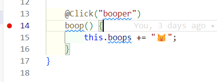
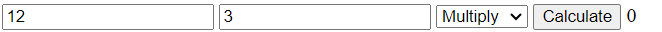

# WebEZ Basics Walkthrough

This walkthrough will help you build and deploy your first WebEZ application. You will learn how to create components, bind values, and handle basic events.

## 0) Setup

1. Click the Github classroom link to create your own copy of the starter repo: <https://classroom.github.com/a/xps8JAYp>
2. Clone the repo to your local machine in an appropriate directory.
3. Open the directory in VS Code, as you normally do.
4. Run `npm install` to install the dependencies.

```bash
npm install
```

5. Normally, you would then run `npm run start` to start the development server. However, we will be using the integrated debugger in VS Code. Activate this by pressing `F5` on your keyboard (or selecting the "Run" tab from the top menu and then clicking `Start Debugging`). This will open a new browser window with your application running. The debugger has a bunch of useful features, like setting breakpoints and inspecting variables - we'll talk more about them later on.

6. You should now be able to see your website. It won't be very exciting at first, but you can now start editing the code and see the changes in real-time!

## 1) Basic HTML

Let's start by adding some dynamic text to the page. We'll need to edit the `MainComponent`, which came with the starter repo. This is the main component that is displayed on the page, and there's always exactly one of them in every WebEZ application. Although we created the component for you, we haven't done anything else. Let's add some text to the page.

1. Expand the `src/app` folder in the sidebar. You will see four files there: `main.component.ts`, `main.component.html`, `main.component.css`, and `main.component.test.ts`. 


  * `main.component.html` is the HTML file that defines the structure of the component. This is where we put the visual content of your application.
  * `main.component.css` is the CSS file that defines the styles for the component. This is how we make things look pretty.
  * `main.component.ts` is the TypeScript file that defines the `MainComponent` class. This is where the application logic will go.
  * `main.component.test.ts` is a (mostly empty) test file for the component. We'll talk more about testing your own components later on.

2. Open `main.component.html`. You will see that it contains the following code:

```html
<div>
    <div class="header">
        <div class="title">hw8-webez-basics Example</div>
    </div>
</div>
```

This is the default content that comes with the starter repo. The `div` tag is a generic container that can hold other elements (a "division" of content). In this case, we have a `div` with the class `header`, which contains a `div` with the class `title`. The `class` attribute is used to apply CSS styles to the element. We'll talk more about CSS later on. For now, focus on the text inside of the `div` tags.

3. Change the text inside the `div` with the class `title` to something else. For example, you could change it to:

```html
<div class="title">My First WebEZ Application</div>
```

4. Save the file. You should see the changes reflected in the browser window automatically. If you don't see the changes, make sure that the debug mode is still running. 

5. Now, let's add a new element to the page with some more text. Add the following code after the `div` with the class `header`, but inside the outer `div`. The `p` tag is used to create a paragraph of text.

```html
<p>Welcome from the HTML side!</p>
```

If you did this correctly, the HTML should look something like the HTML below. Pay close attention to the structure of your HTML, and make sure you are closing all of your tags properly. The location of tags is important, as it determines how the elements are displayed on the page.

```html
<div>
    <div class="header">
        <div class="title">My First WebEZ Application</div>
    </div>
    <p>Welcome from the HTML side!</p>
</div>
```

6. Save the file, and confirm that the new text is displayed in the browser window.
7. We're going to modify the `p` tag to include an `id` attribute. This will make it easier to test our application later on. Add the `id` attribute to the `p` tag, like so:

```html
<p id="example-text">Welcome from the HTML side!</p>
```

Make sure you use the exact `id` value (`example-text`) as shown above. When you save the file, the page will not look any differently. The `id` attribute is used to uniquely identify an element in the HTML document, but does not affect the appearance of the element.

8. Now, let's add some dynamic text to the page. We're going to use TypeScript to change the text of a new `p` tag. Make a second, empty `p` tag with an `id` after the existing one, like so:

```html
<p id="example-target"></p>
```

<details markdown="block">
<summary>Click here to see the full HTML so far</summary>

```html
<div>
    <div class="header">
        <div class="title">My First WebEZ Application</div>
    </div>
    <p id="example-text">Welcome from the HTML side!</p>
    <p id="example-target"></p>
</div>
```

</details>

{: .important-title }

> IDs Matter!
> 
> Make sure you are matching the `id` values exactly as shown above. This will become important when we run the tests later!

9. Open `main.component.ts`. This is the TypeScript file that defines the `MainComponent` class. This is where the application logic will go. You will see that it contains the following code:

```typescript
import html from "./main.component.html";
import css from "./main.component.css";
import { EzComponent } from '@gsilber/webez';

/**
 * @description MainComponent is the main component of the app
 * @extends EzComponent
 * 
 */
export class MainComponent extends EzComponent {

    constructor() {
        super(html, css);
    }
}
```

In WebEZ, components are defined as classes that extend the `EzComponent` class. The `MainComponent` class is the main component of the application, and it is the component that is displayed on the page. The `constructor` method is called when an instance of the class is created. In this case, we are calling the `super` method with the `html` and `css` variables. This is how we tell WebEZ to use the HTML and CSS files that we created. The `html` and `css` variables are just strings that contain the contents of the HTML and CSS files, imported from the files themselves.

10. Add a new private `string` field to the `MainComponent` class called `myText`, with the initial value `"Hello from the TypeScript side!"`. This field will hold the text that we want to display on the page.

```typescript
private myText: string = "Hello from the TypeScript side!";
```

11. On its own, just creating a field doesn't do anything interesting. We need to *bind* the field to the HTML so that the text is displayed on the page. We can do this by using the `BindValue` decorator. Add the following code directly above the `myText` field:

```typescript
@BindValue("example-target")
```

The `@BindValue` decorator is used to bind a field to an element in the HTML; in general, a decorator can enhance the functionality of a field or a method of a class. This decorator takes a single argument, which is the `id` of the element that we want to bind to. In this case, we are binding the `myText` field to the element with the `id` `example-target`.

12.  In order to use the decorator, we must also import the `BindValue` decorator from the `@gsilber/webez` package. Modify the existing import statement at the top of the file to include the `BindValue` decorator:

```typescript
import { EzComponent, BindValue } from '@gsilber/webez';
```

13. If you save the file now, you should be able to see the changes in the live webpage. The text `"Hello from the TypeScript side!"` should be displayed on the page. This is because the `myText` field is bound to the `example-target` element in the HTML. When the field changes, the text on the page will automatically update.

<details markdown="block">
<summary>Click here to see the full TypeScript file so far</summary>

```typescript
import html from "./main.component.html";
import css from "./main.component.css";
import { EzComponent, BindValue } from '@gsilber/webez';

export class MainComponent extends EzComponent {

    @BindValue("example-target")
    private myText: string = "Hello from the TypeScript side!";

    constructor() {
        super(html, css);
    }
}
```

</details>

14. To test if your website is working correctly, you can run the tests that are included with the starter repo. To do this, open a terminal in VS Code and run the following command:

```bash
npm run test main
```

This will run the `main.test.ts` file that is included with the starter repo. If everything is working correctly, you should see a message that says `All tests passed!`. If you see any errors, double-check your code to make sure everything is correct.

## 2) Boop Button Component

Now we'll create a second component that lives in the `MainComponent`. This component will have a button that, when clicked, will add a bit of text to the screen. We'll use this to demonstrate how to handle events in WebEZ. We will call this component the "Boop Button", since our example will be about booping cat's noses. In the image below, every time the button is clicked, another cat head ("🐱") will be added to the record.


1. Begin by creating the new Boop Button component. This requires running a terminal command from within the `src/app` directory. Navigate to the terminal in VS Code and run the following commands:

```bash
cd src/app/
webez c boop-button
```

<details markdown="block">
<summary>Click here to see the expected output for this command</summary>

```
webez v.0.4.11 is starting...
Creating a new component: boop-button
Copying scaffold files
Component scaffold created
Finished
```

</details>

The `c` in the command is short for `component`, and `boop-button` is the name of the new component. This will create a new folder in the `src/app` directory with the necessary files for the new component.
That folder will have the following files: `boop-button.component.ts`, `boop-button.component.html`, `boop-button.component.css`, and `boop-button.component.test.ts`.

2. The component has been created, but it is not yet being used in the `MainComponent`. Open `main.component.ts` and add the following import statement at the top of the file:

```typescript
import { BoopButtonComponent } from './boop-button/boop-button.component';
```

This imports the `BoopButtonComponent` class from the `boop-button.component.ts` file. We will use this class to create an instance of the Boop Button component in the `MainComponent`.

3. Define a new private field in the `MainComponent` class called `boopButton` of type `BoopButtonComponent`. This field will hold an instance of the Boop Button component that should be created when the `MainComponent` is instantiated.

```typescript
private boopButton: BoopButtonComponent = new BoopButtonComponent();
```

4. Although the `MainComponent` class now has a `boopButton` field, it is not yet being displayed on the page. To do this, we need to add the HTML for the Boop Button component to the `main.component.html` file. Open `main.component.html` and add the following line after the `p` tags, but before the final `</div>`:

```html
<div id="boop-button"></div>
```

<details markdown="block">
<summary>Click here to see the <code>main.component.html</code> file so far</summary>

```html
<div>
    <div class="header">
        <div class="title">My First WebEZ Application</div>
    </div>
    <p id="example-text">Welcome from the HTML side!</p>
    <p id="example-target"></p>
    <div id="boop-button"></div>
</div>
```

</details>

5. Next, we have to actually add the component instance from the private field to the content of the `MainComponent`. Open `main.component.ts` and add the following line to the `constructor` method, after the call to `super`:

```typescript
this.addComponent(this.boopButton, "boop-button");
```

This takes the component stored in the `boopButton` field and adds it to the `MainComponent`'s content. The second argument is the `id` of the element in the HTML that the component should be added to. In this case, we are adding the Boop Button component to the element with the `id` `boop-button`. This allows us to place the Boop Button component in the correct location in the HTML; if we didn't specify an `id`, the component would just be added to the end.

<details markdown="block">
<summary>Click here to see the full <code>main.component.ts</code> file so far</summary>

```typescript
import html from "./main.component.html";
import css from "./main.component.css";
import { EzComponent, BindValue } from '@gsilber/webez';
import { BoopButtonComponent } from './boop-button/boop-button.component';

export class MainComponent extends EzComponent {

    @BindValue("example-target")
    private myText: string = "Hello from the TypeScript side!";

    private boopButton: BoopButtonComponent = new BoopButtonComponent();

    constructor() {
        super(html, css);
        this.addComponent(this.boopButton, "boop-button");
    }
}
```

</details>

6. When you save these files, the Boop Button component should now be displayed on the page. However, there is not yet any button or functionality in the Boop Button component, just the default text that comes from creating a new component. Open the `boop-button/boop-button.component.html` file and replace the existing content with the following code:

```html
<div>
    <button id="booper">Boop!</button>
    <p>Boop Record: <span id="boops"></span></p>
</div>
```

This HTML creates a button with the text "Boop!" and a paragraph that displays the boop record, with a `span` tag holding the actual `boops` data. A `span` tag is meant to hold a short, inline snippet of text (inside of a paragraph tag or div). The `boops` span is initially empty, but it will be updated every time the button is clicked. We have also added an `id` attribute to the button (`booper`) and the span element (`boops`), which we will use to bind the button click event and the boop record text. Make sure you get the names of the `id` attributes exactly right, as they will be used in the TypeScript code to bind the elements.

7. Now, we need to add some functionality to the Boop Button component. Open the `boop-button/boop-button.component.ts` file and add a new private `string` field named `boops` to the `BoopButtonComponent` class, initially an empty string. You also need to import the `BindValue` decorator from the `@gsilber/webez` package to *bind* the `boops` field to the `span` with the same `id` in the HTML.

```typescript
import { EzComponent, BindValue } from '@gsilber/webez';
import html from "./boop-button.component.html";
import css from "./boop-button.component.css";

export class BoopButtonComponent extends EzComponent {

    @BindValue("boops")
    private boops: string = "";

    constructor() {
        super(html, css);
    }
}
```

8. When clicked, the button will not do anything yet, because we have not added any event handling to the Boop Button component. We need to add an event handler to the button that will update the `boops` field every time the button is clicked. To do this, we need to add a new method to the `BoopButtonComponent` class that will be called when the button is clicked. We will decorate that button with a special `Click` decorator (which must be imported from `gsilber/webez`. Add the following method to the `BoopButtonComponent` class:

```typescript
@Click("booper")
private boop() {
    this.boops += "🐱";
}
```


{: .note-title }

> Choose Your Own Emoji
> 
> You are free to replace the cat head emoji with any other character or text you like; the tests are flexible. 

The `@Click` decorator is used to bind a method to an event on an element. In this case, we are binding the `boop` method to the `Click` event on the button with the `id` `booper`. This means that every time the button is clicked, the `boop` method will be called. The `boop` method appends a cat head emoji to the `boops` field.

<details markdown="block">
<summary>Click here to see the full <code>boop-button.component.ts</code> file so far</summary>

```typescript
import { BindValue, Click, EzComponent } from "@gsilber/webez";
import html from "./boop-button.component.html";
import css from "./boop-button.component.css";

export class BoopButtonComponent extends EzComponent {
    @BindValue("boops")
    private boops: string = "";

    constructor() {
        super(html, css);
    }

    @Click("booper")
    boop() {
        this.boops += "🐱";
    }
}
```

</details>

9. Save the files and check the live webpage. You should see the Boop Button component with a button that says "Boop!" and a paragraph that displays the boop record. Every time you click the button, a new cat head emoji should be added to the boop record. This demonstrates how to handle events in WebEZ.

10. To test if your website is working correctly, you can run the tests that are included with the starter repo. To do this, open a terminal in VS Code and run the following command:

```bash
npm run test boop
```

11. This is a good time to try out the debugger in VS Code. You can set a breakpoint in the `boop` method in the `BoopButtonComponent` class to see the current values of the variables. To do this, click on the left margin of the editor window next to the line of code where you want to set the breakpoint. A red dot will appear, indicating that a breakpoint has been set. When you click the button on the live webpage, the code will pause at the breakpoint, and you can inspect the values of the variables.




## 3) Simple Calculator Component

Our next component will be a simple calculator. This calculator will have two input fields for numbers, a select box for the operation, and a button to calculate the result. The result will be displayed on the page. We will use this component to demonstrate how to bind values to input fields and select boxes, and how to handle their associated events in WebEZ.



1. Begin by creating the new Simple Calculator component. Once again, this requires running a terminal command from within the `src/app` directory. Navigate to the terminal in VS Code. Most likely, you are already in the `src/app` directory, but if not, run `cd src/app/` and then run the following commands:

```bash
webez c simple-calculator
```

Just like last time, this will create a new folder in the `src/app` directory with the necessary files for the new component. The folder will have the following files: `simple-calculator.component.ts`, `simple-calculator.component.html`, `simple-calculator.component.css`, and `simple-calculator.component.test.ts`.

1. As before, we have to import the new component into the `MainComponent`, create an instance of the component, and add it to the content of the `MainComponent`. Open `main.component.ts`, import the `SimpleCalculatorComponent` class, and add a new private field to the `MainComponent` class called `calculator` of type `SimpleCalculatorComponent`. Then, add the component to the content of the `MainComponent` in the `constructor` method.

<details markdown="block">
<summary>Click here to see what the <code>main.component.ts</code> file should look like when you have done this!</summary>

```typescript
import html from "./main.component.html";
import css from "./main.component.css";
import { BindValue, EzComponent } from "@gsilber/webez";
import { BoopButtonComponent } from "./boop-button/boop-button.component";
import { SimpleCalculatorComponent } from "./simple-calculator/simple-calculator.component";

/**
 * @description MainComponent is the main component of the app
 * @extends EzComponent
 *
 */
export class MainComponent extends EzComponent {
    @BindValue("example-target")
    private myText: string = "Hello from the TypeScript side!";

    private boopButton = new BoopButtonComponent();
    private calculator = new SimpleCalculatorComponent();

    constructor() {
        super(html, css);
        this.addComponent(this.boopButton, "boop-button");
        this.addComponent(this.calculator, "calculator");
    }
}
```

</details>

2. Similarly, you must also add in a new `div` element with the `id` `calculator` to the `main.component.html` file. This will be the location where the Simple Calculator component will be displayed on the page. Open `main.component.html` and add the following line after the `boop-button` `div`, but before the final `</div>`:

```html
<div id="calculator"></div>
```

<details markdown="block">
<summary>Click here to see the <code>main.component.html</code> file when you have done this correctly.</summary>

```html
<div>
    <div class="header">
        <div class="title">My first application!</div>
    </div>
    <p id="example-text">Welcome from the HTML side!</p>
    <p id="example-target"></p>
    <div id="boop-button"></div>
    <div id="calculator"></div>
</div>
```

</details>

3. Once those files are saved, we can see the Simple Calculator component on the live webpage, although it will still just have the default content that comes from creating a new component. Open the `simple-calculator/simple-calculator.component.html` file and replace the existing content with the following code:

```html
<div>
    <input type="number" id="first-number" />
    <input type="number" id="second-number" />

    <select id="operation-select">
        <option value="add">Add</option>
        <option value="subtract">Subtract</option>
        <option value="multiply">Multiply</option>
        <option value="divide">Divide</option>
    </select>

    <button id="calculate-button">Calculate</button>

    <span id="result"></span>
</div>
```

Let's break down all the new elements in the Simple Calculator component:

* The first element is an `input` tag with the `type` attribute set to `number` and an `id` attribute set to `first-number`. This is where the user will input the first number for the calculation. The `type` attribute specifies the type of input field; we could have used `text`, `password`, or other types as well.
* The second element is another `input` tag, with similar settings, but with an `id` attribute set to `second-number`. This is where the user will input the second number for the calculation.
* The third element is a `select` tag with the `id` attribute set to `operation-select`. This is a dropdown box that allows the user to select the operation they want to perform. The `option` tags inside the `select` tag represent the different options in the dropdown box. Each `option` tag has a `value` attribute that specifies the actual value of the option when it is selected. The text inside the `option` tag is what is displayed to the user.
* The fourth element is a `button` tag with the `id` attribute set to `calculate-button`. This is the button that the user will click to perform the calculation. The text inside the `button` tag is what is displayed on the button.
* The fifth element is a `span` tag with the `id` attribute set to `result`. This is where the result of the calculation will be displayed.

4. Next, we need to add some TypeScript functionality to the Simple Calculator component. Open the `simple-calculator/simple-calculator.component.ts` file and add a new private field to the `SimpleCalculatorComponent` class called `firstNumber` of type `number`, initially set to `7`. You also need to import the `BindValueToNumber` decorator from the `@gsilber/webez` package to *bind* the `result` field to the `span` with the same `id` in the HTML. Note that we are using `BindValueToNumber` instead of `BindValue` because the input fields are of type `number`!

```typescript
import { BindValueToNumber, EzComponent } from "@gsilber/webez";
import html from "./simple-calculator.component.html";
import css from "./simple-calculator.component.css";

export class SimpleCalculatorComponent extends EzComponent {
    @BindValueToNumber("first-number")
    private firstNumber: number = 7;

    constructor() {
        super(html, css);
    }
}
```

When saved, the `firstNumber` field should be bound to the `first-number` input field in the HTML. This means that the value of the `firstNumber` field will be displayed in the input field. However, this is a one-way binding; if the user changes the value in the input field, the `firstNumber` field will not be updated. We will add that functionality next.

5. We need to add a new method to the `SimpleCalculatorComponent` class that will be called every time the value in the `first-number` input field changes. We will decorate this method with a special `Input` decorator (which must be imported from `gsilber/webez`, along with another class named `ValueEvent`). Add the following method to the `SimpleCalculatorComponent` class:

```typescript
@Input("first-number")
onFirstNumberChange(event: ValueEvent) {
    this.firstNumber = +event.value;
}
```

{: .note-title }
> Where to Place?
> 
> Put this method in the `SimpleCalculatorComponent` class, fully after the constructor. In general, we recommend putting the fields before the constructor, and the methods after the constructor.

The `@Input` decorator is used to bind a method to an "Input" event on an `input` element. In this case, we are binding the `onFirstNumberChange` method to the `Input` event on the input field with the `id` `first-number`. This means that every time the value in the input field changes, the `onFirstNumberChange` method will be called. The `onFirstNumberChange` method takes an `event` parameter of type `ValueEvent`, which contains the new `value` of the input field. The `+` operator is used to convert the value to a number, since the value is always a string. As long as the user inputs a valid number, this will work correctly.

6. Now we need to do the same thing for the `second-number` input field. Add a new private field to the `SimpleCalculatorComponent` class called `secondNumber` of type `number`, initially set to `3`. Then, add a new method to the `SimpleCalculatorComponent` class that will be called every time the value in the `second-number` input field changes. As before, we will decorate this method with a special `Input` decorator. Add the following code to the `SimpleCalculatorComponent` class:

```typescript
@BindValueToNumber("second-number")
private secondNumber: number = 3;

// ...constructor...

@Input("second-number")
onSecondNumberChange(event: ValueEvent) {
    this.secondNumber = +event.value;
}
```

7. Next, we need to add a new private field to the `SimpleCalculatorComponent` class called `operationSelect` of type `string`, initially set to `"add"`. This field will hold the value of the selected operation from the dropdown box. We also need to import the `BindValue` decorator from the `@gsilber/webez` package to *bind* the `operationSelect` field to the `select` box with the same `id` in the HTML.

```typescript
import { BindValue, BindValueToNumber, EzComponent, Input, ValueEvent } from "@gsilber/webez";
// ...other imports...

export class SimpleCalculatorComponent extends EzComponent {
    // ...other fields...

    @BindValue("operation-select")
    private operationSelect: string = "add";

    // ...other methods...
}
```

8. We need to add a new method to the `SimpleCalculatorComponent` class that will be called every time the value in the `operation-select` select box changes. We will decorate this method with a special `Change` decorator (which must, as always, be imported!). Add the following method to the `SimpleCalculatorComponent` class:

```typescript
@Change("operation-select")
onOperationChange(event: ValueEvent) {
    this.operationSelect = event.value;
}
```

The `@Change` decorator is used to bind a method to a "Change" event on a `select` element. In this case, we are binding the `onOperationChange` method to the `Change` event on the select box with the `id` `operation-select`. The `event` parameter is once again a `ValueEvent`, which contains the new `value` of the select box. This value is then stored in the `operationSelect` field directly, without needing to convert it to a number.

9. We need to add a new private field to the `SimpleCalculatorComponent` class called `result` of type `number`, initially set to `0`. This field will hold the result of the calculation. This field will be bound to the `result` span in the HTML.

```typescript
@BindValueToNumber("result")
private result: number = 0;
```

10. Finally, we need to add a new method to the `SimpleCalculatorComponent` class that will be called every time the button is clicked. We will decorate this method with the `Click` decorator. Add the following method to the `SimpleCalculatorComponent` class:

```typescript
@Click("calculate-button")
calculate() {
    const firstNumber = this.firstNumber;
    const secondNumber = this.secondNumber;
    let result = 0;

    // Do the math
    result = firstNumber + secondNumber;

    this.result = result;
}
```

The `calculate` method gets the values of the `firstNumber` and `secondNumber` fields, performs the calculation based on the selected operation, and stores the result in the `result` field. In this case, we are only performing addition, so you will need to modify this method to handle the other operations as well. Add an `if` statement to check the value of the `this.operationSelect` field and perform the appropriate calculation based on the selected operation.

<details markdown="block">
<summary>Click here to see the full <code>simple-calculator.component.ts</code> file when this is done correctly.</summary>

```typescript
import { BindValue, BindValueToNumber, Change, Click, EzComponent, Input, ValueEvent } from "@gsilber/webez";
import html from "./simple-calculator.component.html";
import css from "./simple-calculator.component.css";

export class SimpleCalculatorComponent extends EzComponent {
    @BindValueToNumber("first-number")
    firstNumber: number = 7;
    @BindValueToNumber("second-number")
    secondNumber: number = 3;

    @BindValue("operation-select")
    operationSelect: string = "multiply";

    @BindValueToNumber("result")
    result: number = 0;

    constructor() {
        super(html, css);
    }

    @Input("first-number")
    onFirstNumberChange(evt: ValueEvent) {
        this.firstNumber = +evt.value;
    }

    @Input("second-number")
    onSecondNumberChange(evt: ValueEvent) {
        this.secondNumber = +evt.value;
    }

    @Change("operation-select")
    onOperationSelectChange(event: ValueEvent) {
        this.operationSelect = event.value;
    }

    @Click("calculate-button")
    calculate() {
        const firstNumber = this.firstNumber;
        const secondNumber = this.secondNumber;
        let result = 0;

        if (this.operationSelect === "add") {
            result = firstNumber + secondNumber;
        } else if (this.operationSelect === "subtract") {
            result = firstNumber - secondNumber;
        } else if (this.operationSelect === "multiply") {
            result = firstNumber * secondNumber;
        } else if (this.operationSelect === "divide") {
            result = firstNumber / secondNumber;
        }

        this.result = result;
    }
}

```

</details>

11. Save the files and check the live webpage. You should see the Simple Calculator component with two input fields for numbers, a dropdown box for the operation, a button to calculate the result, and a span to display the result. You can input numbers into the input fields, select an operation from the dropdown box, and click the button to perform the calculation. The result should be displayed in the span.

{: .note-title }
> Save, Commit, and Push
>
> If you haven't saved, committed, and pushed recently, you should probably do so now. This will ensure that your changes are saved and backed up on Github. 

## 4) Box Editor Component

Our final component will be a Box Editor component. This component will allow the user to create a box around an image with a specified padding, margin, and background color. The user will be able to input these values into input fields and select boxes, and the box will be displayed on the page. We will use this component to demonstrate how to bind values to style properties, and show a little bit about the CSS "Box Model".

Make a new component: Box Editor
- webez component box-editor
- Create the component and add it to MainComponent, don't forget to import
- Copy over the given HTML, piece by piece
- Have to explain the transformer syntax here
- Handle padding
- Handle margin
- Handle background color

## 5) Deploy Your Site

Deploy the repo

- Deploy the repo
  - On the github site, go to Settings
  - Click Pages on the left
  - Change the source dropdown to be Github Actions

